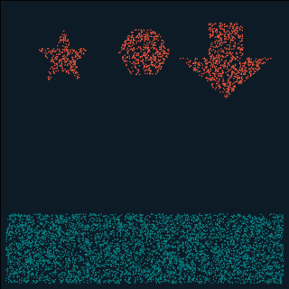

# swimmers

**A 2D fluid + soft-body simulator you drive with shapes.** Pour a pool of
water, drop in *any* polygon you like, choose whether it's a deformable jelly, a
rigid block, or a self-propelling swimmer — and watch them splash, squish, and
push each other around. No special-cased contact code: the coupling falls out of
the physics.


> A self-propelled fish swimming through water (`python examples/fish_swim.py`).
> The fish is one continuous undulating body; the water is MPM particles. Their
> interaction is two-way and automatic.

The engine is **MLS-MPM** (Moving Least Squares Material Point Method). Every
particle — water or solid — scatters its momentum onto one shared background
grid, the grid is solved (gravity + walls), and momentum is gathered back.
Because everything reads and writes the *same* grid, fluid↔solid coupling and
large deformation are properties of the method, not extra code.

## Install

```bash
pip install -e .          # installs the `swimmers` package + dependencies
# or, just the deps for running scripts in-place:
pip install -r requirements.txt
```

## Quickstart

Describe a scene with shapes, then render an animated GIF (or open a live
window). This is the whole API:

```python
from swimmers import Simulation
from swimmers.scenes import star, regular_polygon
import numpy as np

sim = Simulation(gravity=9.8)
sim.add_fluid(lower=(0.02, 0.02), size=(0.96, 0.24))            # a pool of water
sim.add_body(star((0.30, 0.80), 0.10, 0.045), "elastic")        # a soft star
sim.add_body(regular_polygon((0.60, 0.82), 0.09, 6), "rigid")   # a rigid hexagon
sim.render_gif("scene.gif", frames=220)                         # ... or sim.show()
```

### Bring your own shape

A body is just a polygon — an `(N, 2)` array of `(x, y)` points in the unit
square. Hand it anything: a built-in `star`/`regular_polygon`, an outline you
type out, or vertices traced from elsewhere. It gets filled with particles and
simulated as a deformable (or rigid / swimmer) object:

```python
arrow = np.array([(0.44, 0.92), (0.56, 0.92), (0.56, 0.80), (0.66, 0.80),
                  (0.50, 0.66), (0.34, 0.80), (0.44, 0.80)])
sim.add_body(arrow, "elastic")        # any closed polygon works
sim.add_body(my_outline, swim=True)   # give it a muscle -> it swims
```



`python examples/custom_shape.py` — a star, a hexagon, and a hand-written arrow
dropped into water.

## API

`Simulation(n_grid=128, dt=1e-4, gravity=9.8, viscosity=0.0, density=None, arch="cpu", ...)`

| method | what it does |
|--------|--------------|
| `add_fluid(lower, size, velocity)` | add a rectangular pool/column of water |
| `add_body(shape, material, velocity, swim, n_waves)` | fill any polygon with `"elastic"` (default), `"rigid"`, or `"swimmer"` material |
| `step(substeps)` | advance the simulation |
| `positions` | current `(N, 2)` particle positions |
| `render_gif(path, frames, fps, dpi, ...)` | run and write an animated GIF |
| `show(substeps, res)` | open a live Taichi window (`q`/`Esc` to quit) |

Materials: 💧 **water** (weakly compressible fluid), 🟩 **elastic** (deformable
jelly), 🟨 **rigid** (stiff block), 🐟 **swimmer** (elastic + an active muscle).

## Gallery

Every example renders to a GIF (matplotlib + Pillow — no ffmpeg needed):

```bash
python examples/fish_swim.py          # a fish swimming across a tank   -> fish.gif
python examples/custom_shape.py       # arbitrary shapes splashing in   -> custom_shape.gif
python examples/whole_swimmer.py      # a fish across a viscosity sweep  -> whole_swimmer.gif
python examples/swimmer_showcase.py   # a muscle-driven particle fish    -> swimmer.gif
python examples/jellyfish_cell.py     # a pulsing jellyfish bell         -> jellyfish.gif
python examples/viscosity_showcase.py # water vs syrup vs honey          -> viscosity.gif
```

There's also a classic windowed runner for the named scenes:

```bash
python main.py --scene splash         # live window; r = reset, q/Esc = quit
python main.py --scene dam_break --headless --frames 120   # no-window sanity check
```

## Layout

```
src/swimmers/
  sim.py         # Simulation: the high-level "scene from shapes" API
  solver.py      # MPMSolver: P2G → grid update → G2P substep (the physics)
  materials.py   # Material params (Young's modulus, Poisson, density, colour)
  scenes.py      # shape samplers: fill_polygon / fill_rect / fill_circle / star / ...
  render.py      # rasterise frames + write an animated GIF (Pillow)
examples/        # GIF-rendering demos (custom shapes, fish, jellyfish, viscosity)
main.py          # windowed / headless runner for the named scenes
pyproject.toml   # packaging (pip install -e .)
```

## How it works (one substep)

1. **P2G** — each particle's mass and momentum (plus its internal stress) are
   splatted to the 3×3 grid nodes around it with quadratic B-spline weights.
   - Water: shear modulus `μ=0`; stress is pure pressure from its volume ratio `J`.
   - Elastic: fixed-corotated stress `2μ(F−R)Fᵀ + λJ(J−1)I` resists shear *and* volume change.
2. **Grid** — normalise by mass, apply gravity, zero outward velocity at walls.
3. **G2P** — gather velocity back to particles, rebuild the affine field `C`,
   advect positions. The deformation gradient `F` is advanced each step (and
   reset to a purely volumetric form for water, which keeps the fluid stable).

## Tuning

Stiffer materials (higher Young's modulus) and higher viscosity need a smaller
`dt` for stability. Edit per-material parameters in
`src/swimmers/materials.py`, or pass `dt` / `n_grid` / `viscosity` to
`Simulation(...)`.

> Inspired by the modular structure and MPM prototype of
> [allierc/Plexus](https://github.com/allierc/Plexus), specialised here to
> fluid ↔ deformable-solid interaction in 2D.
